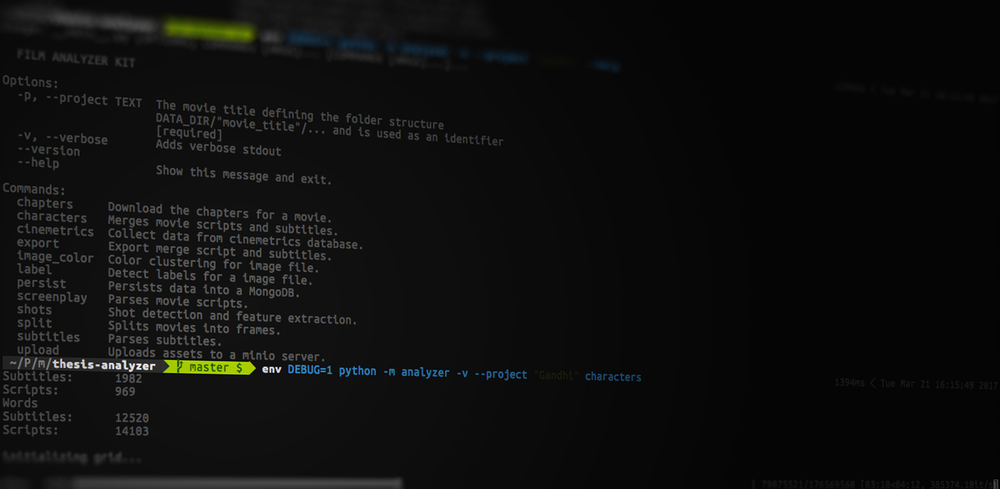

# Film Analyzer Kit
This project is part of my master thesis on video-retrieval with a strong focus on film. It's designed to work as swiss army knife for various feature extraction tasks. One main aspect of this toolkit is the extraction of [shots](https://en.wikipedia.org/wiki/Shot_(filmmaking)) from image data. 

Another feature is the extraction of characters from screenplays and subtitles. To know where characters speak, we can align the screenplay (characters, text) with subtitles (timestamps, text) to retrieve subtitles with character information - see [Everingham et. al. (2006)](http://www.macs.hw.ac.uk/bmvc2006/papers/340.pdf) 

## Prerequisites
### python
The kit is implemented with python. You should use the python version 3.5.

### opencv
The shot detection highly depends on opencv 3.1. Make sure you installed opencv with python bindings.

### ffmpeg
To be able to compare frames, we need to split a video file into  it's frames.For this the toolkit requires [ffmpeg](https://ffmpeg.org/ffmpeg.html).

### Dependencies
There are some python packages, which need to be installed for the toolkit to run. All requirements are listed under the directory `requirements` in `common.txt` and `dev.txt`. You can use the unix `make` command for simple setup, which uses information from the provided `Makefile`.

```
make init
```

## Docker
Maybe the best solution to avoid the installation of opencv, ffmpeg and dependencies is to use docker. For more details how to setup and run this project with docker see [Docker in Depth](#docker-in-depth) below.

## Setup
You can run `python setup.py install` to install to the `analyzer` tool. After that you should be able to use the `analyzer` command from everywhere. 

If you like to run the tool only from within the repository and not use it globally, use `python -m analyzer` instead of `analyzer`.

## Projects

The toolkit organises the input and output data in directories relative to it's execution. It will (if not existing) create the directory `data` relative to your current directory. You can change the data directory by setting the `DATA_DIR` environment variable.

The movie is specified via that `--project` option which is always required and receives the name of the movie. For example if you run `analyzer --project "Rear Window"` a folder under `data` named `rear_window` will be created. All commands with the same `project` are running against the same project directory.

## Frame Extraction
Shot Detection requires each frame of a movie. The frame extraction is realised under the hood with `ffmpeg`. You can use the `split` command, which wraps the functionality of `ffmpeg`. 

```
Usage: __main__.py split [OPTIONS]

  Splits movies into frames.

Options:
  -s, --src PATH  The path to the video source file
  --help          Show this message and exit.
```

```
analyzer --project "Rear Window" split -s /Volumes/SomePath/movie.avi
```
This will create the directory `data/rear_window/frames` with all frames (25 frames per second) from the specified video file.

## Shot Detection
The shot detection is performed in the uncompressed domain using frame by frame comparison. There are two different approaches implemented. The first one is the comparison using color histograms. The color histograms are using the HSV (hue, saturation value) color space with 8, 4, 4 bins per channel respectifly. 

If there is image data in the `frames` directory, you can run the `shots` command. 

```
Usage: __main__.py shots [OPTIONS]

  Shot detection and feature extraction.

Options:
  -t, --threshold FLOAT           Specify the threshold for which shots should
                                  be accepted.
  -e, --extraction-type           [histogram|simpleHistogram|edge|edgeim]
                                  specify the extraction type, currently
                                  specified are <simpleHistoram, edge,
                                  edgeim>.
                                  simpleHistram works with color
                                  historams,
                                  edge uses canny edge detection.
                                  edgeim uses canny edge detection with image
                                  registration.
  -p, --frames-path PATH          Specify the frames path. Currenlty only
                                  works for shots processing, not for copying
                                  of keyframes etc.
  -f, --from-file                 This option uses the locally stored
                                  shots.json. This way one can run color
                                  detection at some other point in time. Very
                                  useful
  -ls, --local-sequence           Use this if you like to run shot detection
                                  on pre calculated shot change ratio. The
                                  file is read from DATA_DIR/<project>/shot-
                                  change-ratio.json
  -c, --color INTEGER             Runs the color clustering to find the main
                                  colors. You can specify the number of
                                  clusters.
  -k, --keyframes                 Copies the keyframes of the detected shots
                                  into DATA_DIR/<project>/keyframes
  -kt, --keyframe-thumbnails      Copies and scales down the keyframes of the
                                  detected shots into
                                  DATA_DIR/<project>/keyframes_thumbnails
  -km, --keyframe-montage         Generates a 10x... jpg grid which contains
                                  all keyframes.
  -l, --label                     Uses google vision api the retrieve labels
                                  to all keyframes. Don't forget to specify
                                  the path to your google api credentials in
                                  GOOGLE_APPLICATION_CREDENTIALS.
  -lt, --limit TEXT...            Limits the considered frames for shot
                                  boundary detection by the given limit. e.g.
                                  --limit 100 2000 if you like to only detect
                                  shots within the frames 100 to 2000.
  -s, --slices                    Creates spatio temporal slices from the
                                  frames within each shot. Is stored under
                                  DATA_DIR/<project>/spatio_temporal_slices.
  --help                          Show this message and exit.
```


### Histogram Method

To extract shots by using the simple color histogram method (only one histogram per Frame) run the `shots` command with the option `-e` or `--extraction-type` to specify the method.

```
analyzer --project "Rear Window" shots -e simpleHistogram 
```

When the shots command is successful it will always store the shot information in `shots.json`.

```javascript
    {
        "duration": 20440,
        "endIndex": 511,
        "id": 0,
        "keyframe": {
            "colors": null,
            "index": 0,
            "labels": null
        },
        "length": 511,
        "startDiff": 0.40277952910400927,
        "startIndex": 0
    },
    ...
```

You can also use a more robust method which uses 4 histograms per frame. This method is as fast as only using one histogram per frame. 

```
analyzer --project "Rear Window" shots -e histogram 
```

The shot extraction uses a global threshold which can be specified via the `-t` or `--threshold` option. You should experiment with this threshold to find the right value for the specific video.

```
analyzer --project "Rear Window" shots -e histogram -t 0.5
```

If you like to run shot extraction on specific rang of frames you can use the `-lt` or `--limit` option. Keep in mind, that the frames are stored with the format of `0000000001.jpg`. To specify to run only against frames `0000000005.jpg` till `0000000050.jpg` you can use: 

```
analyzer --project "Rear Window" shots -e histogram -lt 5 50
```

To extract the keyframes (first frame of a shot) you can use `-k` or `--keyframe` option and `-kt` or `--keyframe-thumbnails` for images in smaller size.

```
analyzer --project "Rear Window" shots -e histogram -k -kt
```

One neat feature is the `-ls` or `--local-sequence` options, which uses the stored shot change ratio stream (see `shot_change_ratio.json`), which will always be stored when `shots` command is successful. This enables you to test different thresholds without running the whole histogram comparison process. 

```
analyzer --project "Rear Window" shots -e histogram -ls -t 0.4 -k
```

There are some other options like color extraction of keyframes, labelling of keyframes, montage of keyframes etc. Have a look at `shots --help` for more details.

### Edge Method
The second method uses the [canny edge detector](https://en.wikipedia.org/wiki/Canny_edge_detector) at it's core. This method works by comparing the edges of successive frames.There are filters like histogram adjustment or blur  required in the process. For more details see [Zabih, Miller, Mai (1999)](https://www.cs.cornell.edu/~rdz/Papers/ZMM-JMS99.pdf).

To run this method use the option `-e` with `edge`.

```
analyzer --project "Rear Window" shots -e edge
```

There is also the possibility to use motion compensation (Enhanced Correlation Coefficient) with the option `-e` with `edgeim`. 

## Character Extraction
Before you can run the alignment of screenplays and subtitles you need some raw data. 

### Subtitle Parsing
```
Usage: __main__.py subtitles [OPTIONS]

  Parses subtitles.

Options:
  -p, --path PATH  The path to the subtitles file. If not specified it will
                   look under DATA_DIR/<projectId>/subtitles.srt
  --help           Show this message and exit.
```
Subtitles have to be downloaded by hand and stored as `subtitles.srt` under the project `data/rear_window`. Make sure the file is encoded as ASCII or UTF-8. 

Getting subtitles into the required `json` representation is done using the `subtitles` command. 

```
analyzer --project "Rear Window" subtitles
```

This will output a `subtitles.json`, with the subtitles data in a format which is easier to process.

```javascript
	...
	{
	    "character": null,
	    "originalText": "That's too bad, Jeff. Well, I guess I can't be lucky every day.",
	    "t1": 273287,
	    "t2": 277803,
	    "text": "That's too bad, Jeff. Well, I guess I can't be lucky every day."
	},
	...
```

### Screenplay Parsing

```
Usage: __main__.py parse_script [OPTIONS]

  Parses movie scripts.

Options:
  -u, --url TEXT  The complete url to the imsdb script
  --help          Show this message and exit.
```

The screenplays are retrieved from [imsdb.com](http://www.imsdb.com/). The process requires some input of you to determine the type of line. The feature is based on a project of [Adrian Luxey](https://github.com/Adrien-Luxey/Da-Fonky-Movie-Script-Parser).

Search for a screenplay on imsdb.com and add the link to the `screenplay` command with the option `-u`.

```
analyzer --project "Rear Window" screenplay -u http://www.imsdb.com/scripts/Rear-Window.html
```

You will then be prompted multiple times to specify the content.

```
Parsing and extracting the first <pre> resulted in the following text:
<pre>                                      "REAR WINDOW"

                                            by

                                    John Michael Hayes

                                  Based on a short story


Is that the script you expected? (Y/n)
```
```
------------------------------ Begin line ------------------------------
               Although we do not see the foreground window frame, we see
------------------------------- End line -------------------------------
There are 15 space(s) at the beginning of this line
What kind of block is that?
        (0) character
        (1) speech
        (2) stage direction
        (3) location
        (4) transition

? [0-4]
```
After annotating the line, you will then be asked if all lines with the intent of x space(s) are of the same kind. This way you don't have to annotate every single line.

```
You said the last block type was 'transition', sure about that? (Y/n) Y
Are all lines with 15 leading spaces 'transition' blocks ? (Y/n)
```

If the screenplay is tagged completely, a `script.json` is stored with all the parsed information.

```javascript
		...
    {
        "character": "GUNNISON",
        "originalText": "Bryce, the only man for this job is\nsitting right here in town.\n\nGet me L. B. Jefferies.",
        "text": "Bryce, the only man for this job is sitting right here in town.  Get me L. B. Jefferies.",
        "type": "speech"
    }
    ...
```

### Alignment
The alignment method is based on a short description in [Everingham et. al. (2006)](http://www.macs.hw.ac.uk/bmvc2006/papers/340.pdf). It uses [Dynamic Time Warping](https://en.wikipedia.org/wiki/Dynamic_time_warping) algorithm to solve the problem of aligning two (different) sequences. The two sequences in this case are dialog information from screenplays and the text in subtitles. The goal is to give each subtitle a character. 

```javascript
	...
	{
	    "character": "JEFF",
	    "originalText": "Who said I was getting rid of it?",
	    "t1": 246447,
	    "t2": 247800,
	    "text": "Who said I was getting rid of it?"
	},
    ...
```

The algorithm only works as good as the raw material of screenplays and subtitles. If the script is a draft version, which could be changed multiple times after, it might not be the best representation of the final movie, which the subtitles represent. The algorithm can handle sequences where it can't align the sequences properly by not setting characters to subtitles. But there is still possibility for false-positive detection due to the nature of the algorithm. 

To run the detection you can use the `characters` command.

```
Usage: __main__.py characters [OPTIONS]

  Merges movie scripts and subtitles.

Options:
  -s, --subtitles-path PATH  The path to the subtitles file. If not specified
                             it will look under
                             DATA_DIR/<projectId>/subtitles.json
  -ms, --movie-script PATH   The path to the parsed movie script file. If not
                             specified it will look under
                             DATA_DIR/<projectId>/subtitles.json
  -a, --algorithm [dtw|nw]   Specify the algorithm for alignment, you can use
                             <dtw> (Dynamic Time Warping) or <nw> Needlemann-
                             Wunsch. Default value is is dtw.
  -p, --partial INTEGER      Use only a fraction of the available data. If you
                             want to use 1/4 of the data write -p 4. Mainly
                             handy for testing the algorithms.
  --help                     Show this message and exit.
```

```
analyzer --project "Rear Window" characters
```

Besides the dynamic time warping (dtw) algorithm there is also the possibility to run the alignment with [Needleman-Wunsch](https://en.wikipedia.org/wiki/Needleman%E2%80%93Wunsch_algorithm) algorithm. This is an experimental feature to improve the alignment performance and did not jet found mention in the literature. At the core it compares the sequences by character, not by word. This increases the score matrix radically and requires a lot more memory resources than the dtw-based method. The needleman-wunsch-based method achieves similar if not minimal improved results but takes more time and gigabytes of RAM. 

To use the needleman-wunsch-based method use the "-a" or "--algorithm" option with `nw`. The default value is `dtw`. 

```
analyzer --project "Rear Window" characters -a nw
```

For testing purposes you can use the `-p` or `--partial` option, which will only run the alignment against a specified part of the data. For example if you to run against quarter (25%) of the material, use:
 
```
analyzer --project "Rear Window" characters -p 4
```

The output the `characters` command is the `merged_subtitles.json`. Furthermore a log file like `2017-02-22_10-29-00.txt` is written to the project, with detailed matching information.

## Chapters
```
Usage: __main__.py chapters [OPTIONS]

  Download the chapters for a movie.

Options:
  -t, --title TEXT  Specify the title of the movie if divergent to the project
                    name. Make sure you have CHAPTER_DB_API_KEY specified.
  --help            Show this message and exit
```

This is a neat little helper to download DVD-Chapters from [ChapterDb](http://www.chapterdb.org/). You only need an API-Key which can be retrieved from your [ChapterDb](http://www.chapterdb.org/)s account page.
Hand the env variable `CHAPTER_DB_API_KEY` over or set it via the `.env` file. 

```
CHAPTER_DB_API_KEY=<YOUR_KEY> analyzer --project "Rear Window" chapters
```

The toolkit will use the `--project` title to search for results, if you like to specify a differing title use the `-t` or `--title` option.
You will then be prompted to select the `ID` you would like to download. The `CONFIRMATIONS` gives you a glimpse how good the results are.

```
<ID>    <CONFIRMATIONS>         <TITLE>
60461           8               Rear Window
2611            5               Rear Window
77826           5               Rear Window
60728           2               Rear Window
3430            1               Rear Window
...

Select id:
```

After giving the `ID` the toolkit will download the chapters and stores them in `chapters.json`.

## Persistance
It is possible to persist the parsed title (project), chapters, subtitles and screenplay data to a [mongoDB](https://www.mongodb.com/). You should have a running instance with a user and required write privileges.

You can set the credentials, host and database name information via command line options or use the environment variables DB_HOST, DB_USER, DB_PASS and DB_NAME.

```
Usage: __main__.py persist [OPTIONS]

  Persists data into a MongoDB.

Options:
  -h, --host TEXT    The host url of the database.
  -u, --user TEXT    The username of the database.
  -p, --passwd TEXT  The password of the database.
  -t, --title        Write title (project) data to database.
  -s, --shots        Write shots data to database.
  -sub, --subtitles  Write subtitle data to database.
  -c, --chapters     Write chapters data to database.
  --help             Show this message and exit.
``` 

For example to persist all the parsed data you can use:

```
analyzer --project "Rear Window" perist -t -s -sub -c
```

This will create, if not existing, mongoDB collections for each type. 
 
## Upload
Due to the requirements of my thesis, image data can be uploaded to a [minio](https://minio.io/) server.
 
 ```
 Usage: __main__.py upload [OPTIONS]

  Uploads assets to a minio server.

Options:
  -k, --keyframes             Uploads keyframes.
  -kt, --keyframe-thumbnails  Uploads keyframe-thumbnails.
  -f, --frames                Uploads all frames.
  -s, --slices                Uploads spatio temporal slices.
  --help                      Show this message and exit
 ```
 
## Docker in Depth
### Creating Image
You can build a docker image from the provided `Dockerfile` using: 

```
docker build -t <name>/<project name> .
```

_Note: Change the name and project name to you needs.
This will also download all required docker images, which might take awhile._

### Running a Container

To create a container from a docker image, run the following command: 

```
docker run -v $(pwd)/data:/data -it --env-file .env -d --name analyzer <name>/<project name>
```

There are quite a lot of things happening there.
First we need to set a volume, which the docker container and your operating system share. In the example above it just uses the current directory + data directory `$(pwd)/data` and map it to the `/data/` directory of the docker container. This way you can share data between the docker container and your host system. 

Next, you hand over a file with environment variables. The toolkit expects some variables, which can be found in `.env.examples`. Just copy the file and adjust it to your needs.
You can also specify [environment variables](https://docs.docker.com/docker-cloud/getting-started/deploy-app/6_define_environment_variables/) via docker command line option `-e` or `--env`.

Now that the container is running, you can attach to it using: 

```
docker exec -it analyzer /bin/bash
```

This connects you to the interactive shell where you can use the analyzer command as described above.

```
root@4861c0561b89:/usr/src/app# 
root@4861c0561b89:/usr/src/app# analyzer -project "Rear Window" shots
```

No install of dependencies required, yey!

Final Note:
This project is part of my master thesis, which also deals with visualization of film. 
For a examplary why to visualize the data retrieved with the film analyzer kit please refere to [FilmBrowser](https://github.com/Miiha/FilmBrowser).

